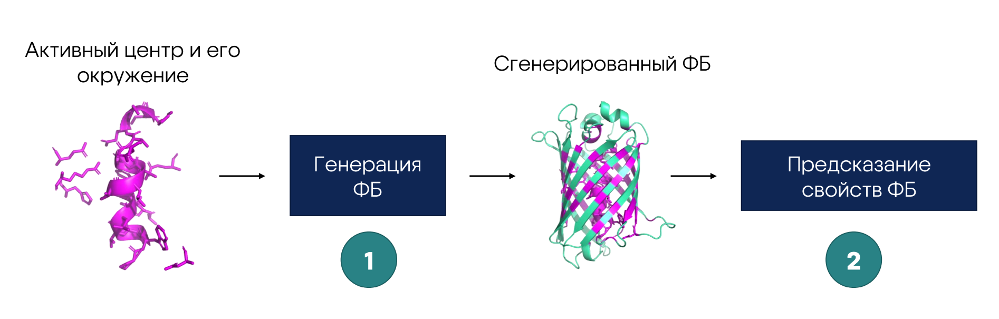

# Генерация новых флуоресцентных белков по заданным свойствам

<p align="center">
  
</p>

<p align="center">
  <a href="https://fluorescentprotein-bv2025.tilda.ws/page72379799.html">
    
  </a>
</p>

<div align="center">

<table><tr><td width="550"><div align="center">
  <p><sup>Партнеры</sup></p>

  <p><a href="https://konkurs.sochisirius.ru/">
    <picture>
      <source media="(prefers-color-scheme: dark)">
      
    </picture>
    <br>
    <br><sup>Научно-технологическая программы, реализующаяся в Образовательном центре «Сириус»</sup>
  </a></p>

  <p><a href="https://biocad.ru/">
    <picture>
      <source media="(prefers-color-scheme: dark)">
      
    </picture>
    <br>
    <br><sup>Одна из крупнейших биотехнологических инновационных компаний в России</sup>
  </a></p>

</div></td></tr></table>

</div>


## Установка
Установите библиотеку через ```pip install```:
```
pip install --upgrade git+https://github.com/rimgro/biocadprotein.git
```

Чтобы загрузить веса модели ESM3, примите [лицензию на Hugging Face](https://huggingface.co/EvolutionaryScale/esm3-sm-open-v1).

## Быстрый старт
### Генерация нового белка

<div align="center">
  
</div>

```python
from fpgen.generation.generator import ProteinGenerator

from esm.models.esm3 import ESM3
from esm.sdk.api import ESMProtein
from esm.utils.structure.protein_chain import ProteinChain

from huggingface_hub import login

# Вам необходимо получить API ключ от Hugging Face
login(token=...)

# Загрузка белка, на основе которого будет генерация нового
template_protein = ESMProtein.from_protein_chain(
    ProteinChain.from_rcsb('1qy3', chain_id='A')
)
# Индексы активного центра и его окружения (то, что не будет маскироваться)
# Нуммерация начинается с 0
aplha_phelix = [5, 133, 9, ..., 118, 120, 122]

# Загрузка модели
model = ESM3.from_pretrained('esm3-open').to('cuda')
# Создание генератора (на основе белка, альфа-спирали и модели)
generator = ProteinGenerator(template_protein, aplha_phelix, model)
# Генерация
generated_protein, _ = generator.generate()
```

**Дополнительные параметры**
```python
from fpgen.generation.metrics import Metric

protein, metric = generator.generate(
    # Использование метрик
    # (calculate_on_full_atom означает, что мы будем расчитывать метрику на полноатомной структуре),
    # а не на скелете
    metric_list=[
        Metric('rmsd', calculate_on_full_atom=True),
        Metric('ptm'),
        Metric('plddt')
    ],
    # Сгенерировать также полноатомную структуру белка
    fix_protein=True
)

print(metric)
```

### Предсказание флуоресцентных свойств белка

<div align="center">
  
</div>

<br>

Условия тестирования:
- Датасет: [FPbase](https://www.fpbase.org/)
- Тестовая выборка: 20%

### Предсказание по аминокислотной последовательности

Результаты: качество предсказания длины волны испускания (λ<sub>em_max</sub>)

<div align="center">

<table>
  <thead>
    <tr>
      <th>Модель</th>
      <th>RMSE, нм ↓</th>
      <th>MAE, нм ↓</th>
      <th>R² ↑</th>
      <th>MAE (med.), нм ↓</th>
    </tr>
  </thead>
  <tbody>
    <tr><td>kNN (seq identity)</td><td>33.9</td><td><b>15.9</b></td><td>0.69</td><td><b>2.0</b></td></tr>
    <tr><td>ESM C + kNN</td><td>37.3</td><td>23.5</td><td>0.62</td><td>13.4</td></tr>
    <tr><td>CNN</td><td>33.9</td><td>22.2</td><td>0.70</td><td>14.8</td></tr>
    <tr><td>ESM C + CNN</td><td><b>30.9</b></td><td>21.4</td><td>0.74</td><td>14.3</td></tr>
    <tr><td>LSTM</td><td>31.9</td><td>19.4</td><td><b>0.75</b></td><td>10.4</td></tr>
    <tr><td>ESM C + LSTM</td><td>39.8</td><td>30.2</td><td>0.55</td><td>18.5</td></tr>
  </tbody>
</table>

</div>

### Предсказание по структуре

В рамках проекта был создан датасет с предсказанными на основе последовательностей из FPbase структурами белков с помощью модели [ESMfold](https://github.com/mingkangyang/esmfold)

<p align="center"><a href="https://www.kaggle.com/datasets/nikitabakutov/fpbase-structures">
  
</a></p>


```python
from fpgen.prop_prediction.predictor import PropertiesPredictor

predictor = PropertiesPredictor()
properties = predictor.predict(generated_protein)

print(properties)
```

## Авторы
- [Рим Громов](https://github.com/rimgro)
- Илья Тыщенко
- [Артем Подлегаев](https://github.com/artemkaFismat)
- Мария Киселева
- [Никита Бакутов](https://github.com/droyti46)

## Руководители
- Павел Ким
- Никита Вяткин