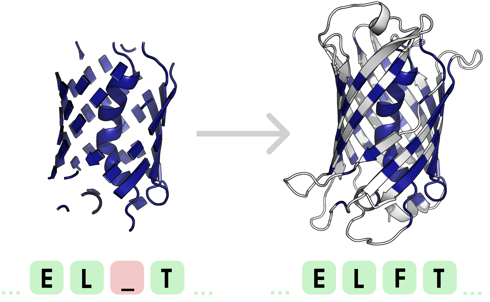
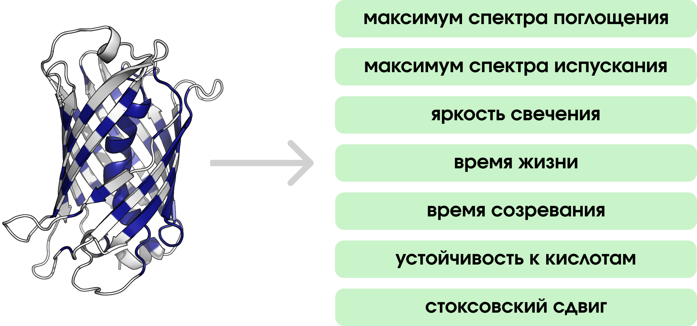

# Генерация новых флуоресцентных белков по заданным свойствам

<br>

<div align="center">
  
</div>

<br>

## Установка
Установите библиотеку через ```pip install```:
```
pip install --upgrade git+https://github.com/rimgro/biocadprotein.git
```

Чтобы загрзить веса модели ESM3, примите [лицензию на Hugging Face](https://huggingface.co/EvolutionaryScale/esm3-sm-open-v1).

## Быстрый старт
### Генерация нового белка

<div align="center">
  
</div>

```python
from fpgen.generation.generator import ProteinGenerator

from esm.models.esm3 import ESM3
from esm.sdk.api import ESMProtein
from esm.utils.structure.protein_chain import ProteinChain

from huggingface_hub import login

# Вам необходимо получить API ключ от Hugging Face
login(token=...)

# Загрузка белка, на основе которого будет генерация нового
template_protein = ESMProtein.from_protein_chain(
    ProteinChain.from_rcsb('1qy3', chain_id='A')
)
# Индексы активного центра и его окружения (то, что не будет маскироваться)
# Нуммерация начинается с 0
aplha_phelix = [5, 133, 9, ..., 118, 120, 122]

# Загрузка модели
model = ESM3.from_pretrained('esm3-open').to('cuda')
# Создание генератора (на основе белка, альфа-спирали и модели)
generator = ProteinGenerator(template_protein, aplha_phelix, model)
# Генерация
generated_protein, _ = generator.generate()
```

**Дополнительные параметры**
```python
from fpgen.generation.metrics import Metric

protein, metric = generator.generate(
    # Использование метрик
    # (calculate_on_full_atom означает, что мы будем расчитывать метрику на полноатомной структуре),
    # а не на скелете
    metric_list=[
        Metric('rmsd', calculate_on_full_atom=True),
        Metric('ptm'),
        Metric('plddt')
    ],
    # Сгенерировать также полноатомную структуру белка
    fix_protein=True
)

print(metric)
```

### Предсказание флуоресцентных свойств белка

<div align="center">
  
</div>

```python
from fpgen.prop_prediction.predictor import PropertiesPredictor

predictor = PropertiesPredictor()
properties = predictor.predict(generated_protein)

print(properties)
```

## Авторы
- [Рим Громов](https://github.com/rimgro)
- Илья Тыщенко
- [Артем Подлегаев](https://github.com/artemkaFismat)
- Мария Киселева
- [Никита Бакутов](https://github.com/droyti46)

## Руководители
- Павел Ким
- Никита Вяткин