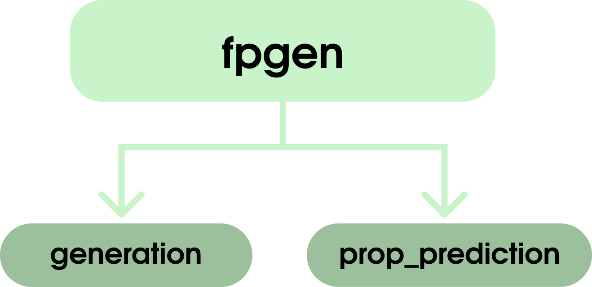

# fpgen

Разработанная в рамках проекта библиотека для работы использования созданных нами решений

  

## Файлы
- `generation/`: модуль для генерации белков
- `prop_prediction/`: модуль для предсказания свойств белков
- `utils.py`: вспомогательные функции
- `visualization.py`: функции для визуализации